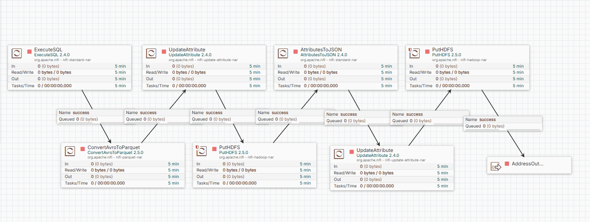

# Data Ingestion 

## Overview

Apache NiFi is used as the backbone for orchestrating data movement from OLTP sources to the Data Lake (HDFS). It enables reliable, scalable, traceable, and repeatable ETL processes through a visual interface.

---

## NiFi Pipeline Architecture

The NiFi pipeline consists of the following core stages:

1. **Data Extraction**  
   - **ExecuteSQL** processors extract data from various source tables (SalesOrderHeader, Address, CreditCard, Customer, CurrencyRate, Person, ShipMethod, Store, Territory).
2. **Data Transformation**  
   - **UpdateAttribute** processors are used to enrich, route, or tag the data as required.
   - **ConvertAvroToParquet** processor converts extracted Avro format data into Parquet format for efficient storage and analytics.
   - **AttributesToJSON** processor transforms attributes into JSON format to be saved as metadata
3. **Data Loading**  
   - **PutHDFS** processors write the transformed data into HDFS
   - **InvokeHTTP** used to trigger Airflow Dag for ETL Orchestration

---

## Table-Level Data Ingestion

**Extracted Tables:**

- SalesOrderHeader
- Address
- CreditCard
- Customer
- CurrencyRate
- Person
- ShipMethod
- Store
- Territory

**Flow Notes:**
- Each table extraction is connected to its respective output
---
## Images Overview

### Project's Process Group Workflow

### Sub-Process Groups Workflow
